# AI-Powered Data Science & Analytics Project Definition

- Updated: 2025.06.09

## Project Name: SmartRecon - Intelligent Financial Reconciliation Assistant

## Financial Reconciliation Workflow

```mermaid
flowchart TD
    Start([Start Reconciliation]) --> DC1
    
    %% Step 1: Data Collection
    subgraph DataCollection [Data Collection]
        DC1[Extract GL entries from ERP] 
        DC2[Obtain bank statements]
        DC3[Validate file formats and completeness]
    end
    
    DC1 --> DC2 --> DC3 --> DP1
    
    %% Step 2: Data Preparation
    subgraph DataPreparation [Data Preparation]
        DP1[Standardize date formats]
        DP2[Normalize descriptions]
        DP3[Convert currency formats] 
        DP4[Remove duplicates]
        DP5[Handle missing values]
    end
    
    DP1 --> DP2 --> DP3 --> DP4 --> DP5 --> DM1
    
    %% Step 3: Data Mapping
    subgraph DataMapping [Data Mapping]
        DM1[Identify matching fields]
        DM2[Create uniform column names]
        DM3[Apply business rules for categorization]
    end
    
    DM1 --> DM2 --> DM3 --> RP1
    
    %% Step 4: Reconciliation Process
    subgraph ReconProcess [Reconciliation Process]
        RP1[Match transactions on key identifiers]
        RP2[Identify exact matches]
        RP3[Apply fuzzy matching]
        RP4[Flag unmatched items]
        RP5[Calculate variances]
    end
    
    RP1 --> RP2 --> RP3 --> RP4 --> RP5 --> EH1
    
    %% Step 5: Exception Handling
    subgraph ExceptionHandling [Exception Handling]
        EH1[Categorize exceptions]
        EH2[Investigate unmatched items]
        EH3[Document explanations]
        EH4{Need adjustments?}
        EH5[Create adjustment entries]
        EH6[Mark as reviewed]
    end
    
    EH1 --> EH2 --> EH3 --> EH4
    EH4 -->|Yes| EH5 --> R1
    EH4 -->|No| EH6 --> R1
    
    %% Step 6: Reporting
    subgraph Reporting [Reporting]
        R1[Generate reconciliation summary]
        R2[Create exception reports]
        R3[Produce audit trail]
        R4[Create visualizations]
    end
    
    R1 --> R2 --> R3 --> R4 --> D1
    
    %% Step 7: Documentation
    subgraph Documentation [Documentation]
        D1[Save reconciliation state]
        D2[Document explanations]
        D3[Export finalized reconciliation]
    end
    
    D1 --> D2 --> D3 --> End([End Reconciliation])
    
    %% Styling
    classDef process fill:#e1f5fe,stroke:#01579b,stroke-width:2px
    classDef decision fill:#fff3e0,stroke:#e65100,stroke-width:2px
    classDef startend fill:#f3e5f5,stroke:#4a148c,stroke-width:2px
    
    class DataCollection,DataPreparation,DataMapping,ReconProcess,ExceptionHandling,Reporting,Documentation process
    class EH4 decision
    class Start,End startend
```



## Project and Work Product Description:
SmartRecon addresses the time-consuming and error-prone process of manual financial reconciliation between GL entries and external sources. Financial analysts currently spend 15-20 hours monthly manually comparing transactions, investigating discrepancies, and documenting exceptions. This solution automates data extraction, standardization, and matching using advanced algorithms, reducing reconciliation time by 70% and improving accuracy. SmartRecon provides a complete workflow from data import to exception reporting, enabling analysts to focus on high-value analytical tasks rather than tedious data comparisons.

**AS-IS Workflow:**
1. Manual export of data from ERP and banking systems
2. Manual formatting in Excel
3. Line-by-line comparison of transactions
4. Manual documentation of exceptions
5. Manual creation of adjustment entries
6. Manual report creation

**TO-BE Workflow:**
1. Automated data import from multiple sources
2. Intelligent data cleaning and standardization
3. Algorithm-based transaction matching
4. Automated exception flagging and categorization
5. Interactive exception resolution
6. Automated report generation

## Description of Solution:
SmartRecon employs Python with Pandas for data processing and reconciliation logic, automating the entire workflow from data import to reporting. The system accepts multiple file formats, performs intelligent data cleaning, applies exact and fuzzy matching algorithms to identify corresponding transactions, and generates comprehensive reports. The MVP (v1.0) delivers core reconciliation functionality with command-line interface, supporting CSV/Excel imports, basic matching algorithms, and standard reports. Future versions will introduce a Streamlit-based GUI (v2.0), advanced matching algorithms with machine learning (v3.0), and integration capabilities with accounting systems (v4.0).

## Solution Design (high-level):

1. **Data Ingestion Module**
   - File upload/import functionality
   - Format validation
   - Schema detection
   - Initial data quality assessment

2. **Data Preparation Module**
   - Date standardization
   - Amount normalization
   - Description cleaning
   - Missing value handling
   - Duplicate detection

3. **Reconciliation Engine**
   - Exact matching algorithm
   - Fuzzy matching for descriptions
   - Variance calculation
   - Exception categorization

4. **Exception Management**
   - Classification of unmatched items
   - Suggested matching based on similarity
   - Manual match interface
   - Exception documentation

5. **Reporting Module**
   - Summary statistics
   - Exception detailed reports
   - Visualizations
   - Export functionality

### Solution Code Description (low-level design):
- **data_financial_data.py**: Creates application testing and simulation data
- **data_ingestion.py**: Handles file import, validation, and schema mapping
- **data_cleaning.py**: Implements data standardization and quality enhancement
- **matching_engine.py**: Contains exact and fuzzy matching algorithms
- **exception_handler.py**: Manages unmatched transactions and classifications
- **reporting.py**: Generates reports and visualizations
- **main.py**: Orchestrates the reconciliation workflow
- **config.py**: Contains configuration parameters
- **utils.py**: Utility functions used across modules

### Actual Working Product Code:
The complete code repository will be hosted on GitHub with the following structure:
```
smartrecon/
├── src/
│   ├── data_ingestion.py
│   ├── data_cleaning.py
│   ├── matching_engine.py
│   ├── exception_handler.py
│   ├── reporting.py
│   ├── main.py
│   ├── config.py
│   └── utils.py
├── tests/
│   ├── test_data_ingestion.py
│   ├── test_data_cleaning.py
│   ├── test_matching_engine.py
│   ├── test_exception_handler.py
│   └── test_reporting.py
├── examples/
│   ├── sample_gl_data.csv
│   ├── sample_bank_data.csv
│   └── example_config.json
├── docs/
│   ├── user_guide.md
│   └── developer_guide.md
├── requirements.txt
└── README.md
```

## List of SDLC Documents
1. Project Requirements Specification
2. Functional Design Document
3. Technical Design Document
4. Test Plan and Test Cases
5. User Manual
6. Installation Guide
7. Version History and Change Log

## Application Instructions:

### Installation and Setup
1. Ensure Python 3.8+ is installed on your system
2. Clone the repository: `git clone https://github.com/organization/smartrecon.git`
3. Navigate to the project directory: `cd smartrecon`
4. Create a virtual environment: `python -m venv venv`
5. Activate the virtual environment:
   - Windows: `venv\Scripts\activate`
   - macOS/Linux: `source venv/bin/activate`
6. Install dependencies: `pip install -r requirements.txt`

### Running the Application
1. Prepare your source files (GL extract and bank statement) in CSV or Excel format
2. For command-line interface (v1.0):
   ```
   python src/main.py --gl-file path/to/gl_file.csv --bank-file path/to/bank_file.csv --output-dir path/to/output
   ```
3. For GUI interface (v2.0+):
   ```
   python src/app.py
   ```
   Then access the web interface at `http://localhost:8501`

### Configuration
1. Create a configuration file following the template in `examples/example_config.json`
2. Specify column mappings for your specific file formats
3. Set matching criteria and tolerance levels
4. Configure reporting preferences

### Data Requirements
- Files must contain at minimum: transaction date, amount, and reference/description fields
- Dates should be in standard formats (YYYY-MM-DD preferred)
- Amount columns should be numeric or standard currency format
- Files should cover the same time period for effective reconciliation

### Additional Important Guidelines
- Regularly backup your reconciliation files and reports
- For large datasets (>100,000 transactions), increase the recommended system memory to 8GB+
- Review the detailed user guide for advanced features and troubleshooting
- For custom integrations with accounting systems, refer to the API documentation
