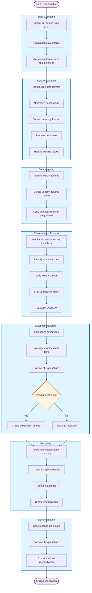

# SmartRecon - Project Overview

## Workflow Diagram

```mermaid
flowchart TD
    Start([Start Reconciliation]) --> DC1
    
    %% Step 1: Data Collection
    subgraph DataCollection [Data Collection]
        DC1[Extract GL entries from ERP] 
        DC2[Obtain bank statements]
        DC3[Validate file formats and completeness]
    end
    
    DC1 --> DC2 --> DC3 --> DP1
    
    %% Step 2: Data Preparation
    subgraph DataPreparation [Data Preparation]
        DP1[Standardize date formats]
        DP2[Normalize descriptions]
        DP3[Convert currency formats] 
        DP4[Remove duplicates]
        DP5[Handle missing values]
    end
    
    DP1 --> DP2 --> DP3 --> DP4 --> DP5 --> DM1
    
    %% Step 3: Data Mapping
    subgraph DataMapping [Data Mapping]
        DM1[Identify matching fields]
        DM2[Create uniform column names]
        DM3[Apply business rules for categorization]
    end
    
    DM1 --> DM2 --> DM3 --> RP1
    
    %% Step 4: Reconciliation Process
    subgraph ReconProcess [Reconciliation Process]
        RP1[Match transactions on key identifiers]
        RP2[Identify exact matches]
        RP3[Apply fuzzy matching]
        RP4[Flag unmatched items]
        RP5[Calculate variances]
    end
    
    RP1 --> RP2 --> RP3 --> RP4 --> RP5 --> EH1
    
    %% Step 5: Exception Handling
    subgraph ExceptionHandling [Exception Handling]
        EH1[Categorize exceptions]
        EH2[Investigate unmatched items]
        EH3[Document explanations]
        EH4{Need adjustments?}
        EH5[Create adjustment entries]
        EH6[Mark as reviewed]
    end
    
    EH1 --> EH2 --> EH3 --> EH4
    EH4 -->|Yes| EH5 --> R1
    EH4 -->|No| EH6 --> R1
    
    %% Step 6: Reporting
    subgraph Reporting [Reporting]
        R1[Generate reconciliation summary]
        R2[Create exception reports]
        R3[Produce audit trail]
        R4[Create visualizations]
    end
    
    R1 --> R2 --> R3 --> R4 --> D1
    
    %% Step 7: Documentation
    subgraph Documentation [Documentation]
        D1[Save reconciliation state]
        D2[Document explanations]
        D3[Export finalized reconciliation]
    end
    
    D1 --> D2 --> D3 --> End([End Reconciliation])
    
    %% Styling
    classDef process fill:#e1f5fe,stroke:#01579b,stroke-width:2px
    classDef decision fill:#fff3e0,stroke:#e65100,stroke-width:2px
    classDef startend fill:#f3e5f5,stroke:#4a148c,stroke-width:2px
    
    class DataCollection,DataPreparation,DataMapping,ReconProcess,ExceptionHandling,Reporting,Documentation process
    class EH4 decision
    class Start,End startend
```

## Heading level 2 
